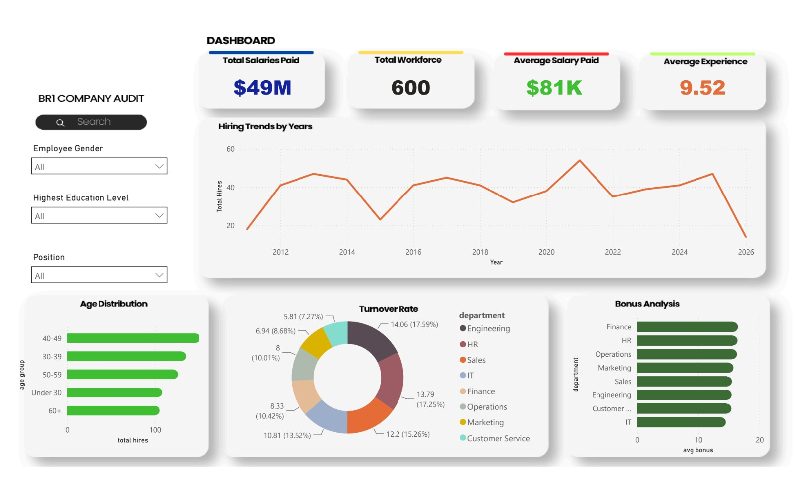

# BR1-Company-Audit
An interactive HR analytics dashboard analyzing workforce composition, hiring trends, turnover, and compensation for a 600-person organization.

# Overview
This dashboard was built to answer a core business question: where is this company losing people, and is compensation keeping up with tenure and role? It combines workforce demographics, hiring trends, turnover by department, and bonus distribution into a single view, with filters for gender, education level, and position so stakeholders can slice the data by their own questions.

# Tools Used
- Power BI
- DAX for calculated measures (turnover %, average bonus, average tenure)
- Data cleaning in Power Query

Key Insights
1. Turnover is concentrated in Engineering and HR. These two departments account for ~35% of total turnover combined (17.6% and 17.3% respectively) — well above Customer Service (7.3%), the lowest. This is worth flagging to leadership as a retention risk, particularly in Engineering, where replacement cost and ramp-up time tend to be highest.

2. The workforce skews mid-to-senior career. The 40-49 age group is the largest single cohort, and average experience sits at 9.52 years. Combined with relatively low Under-30 headcount, this suggests the company may be under-investing in early-career pipeline — a risk if senior staff turnover increases or retire in the next 5-10 years.

3. Bonus allocation doesn't clearly track turnover risk. Average bonus is fairly flat across departments (~14-17 range), including in Engineering and HR — the two highest-turnover departments. If retention is a stated priority, this flat distribution suggests bonus structure isn't currently being used as a lever to address it.

4. Hiring has been volatile, not steadily growing. Total hires per year swing significantly (a dip around 2015, a peak near 2021, another falling into 2026). This pattern is worth investigating against company milestones (funding rounds, restructuring, market conditions) to understand whether hiring is reactive or planned.

# Data Source
Synthetic Data generated by Claude AI.

# Filters
- Employee Gender
- Highest Education Level
- Position

These allow the dashboard to be explored beyond the headline view shown above.

